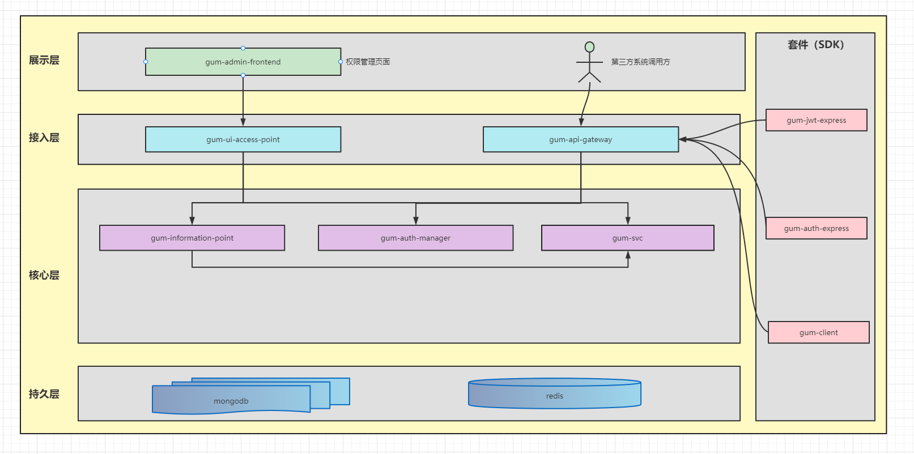

<!-- @import "[TOC]" {cmd="toc" depthFrom=1 depthTo=6 orderedList=false} -->

<!-- code_chunk_output -->

- [GUM - A general user management system](#gum-a-general-user-management-system)
- [Architecture diagram](#architecture-diagram)
- [Features](#features)
- [Usage](#usage)
- [Design](#design)
- [Deployment](#deployment)

<!-- /code_chunk_output -->

# GUM - A general user management system
**GUM(general user management system,通用用户管理系统)**,提供一站式的用户权限管理功能。其特点是灵活，方便，且功能强大。提供包括前端的响应式的权限设置，后端API认证和鉴权。
同时，设计之初秉承尽可能少地嵌入目标业务系统理念，最大限度地与目标系统解耦
# Architecture diagram  

# Features
- **权限控制功能强大**  
提供前端响应式权限策略执行，同时提供后端API接口认证和鉴权，其为了方便用户使用，提供中间件组件形式；
- **使用成本低**  
接入成本非常低，几乎可以忽略不计。前端可以通过引入Vue组件使用。后端可以使用 middleware 中间件使用； 
- **嵌入目标系统耦合度低**  
由于接入方式的灵活便捷，因此使得对目标系统几乎零侵入。通过组件或者中间件的方式引用即可
- **部署简单**  
只需要部署系统各微服务代码即可，且只依赖了 mongo 和 redis(非必须，如目标系统体量不大，无需观察者，可以不用)

# Usage
1. [前端接入指南]()
2. [后端接入指南]()
3. [客户端使用指南]()
4. 中间件使用指南  
    * [认证中间件使用指南]()  
    * [鉴权中间件使用指南]()  
6. [GUM实践案例]()

# Design
1. [系统架构设计](https://github.com/General-User-Management/gum-doc/blob/master/markdown/architecture.md)
2. [权限元数据设计]() 

# Deployment
1. [Quick Start]()
2. [分布式部署指南]()