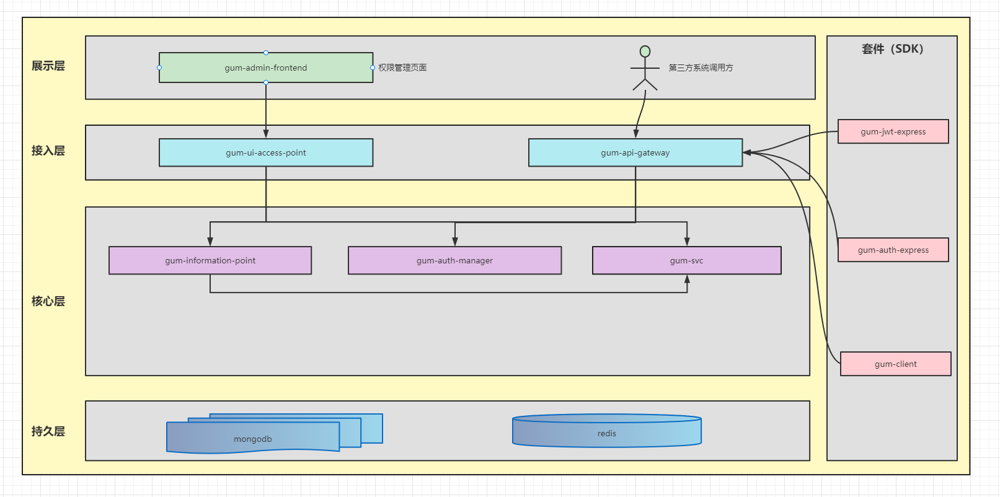

[TOC]

#### 架构图

#### 服务职责
- gum-svc  
主要是对 casbin 能力的封装，实现接口的鉴权以及RBAC管理；
使用 MongoDB 作为权限数据的存储，使用 redis 作为多副本实例时的观察者 
- gum-client  
提供 gum-svc 两个能力，1.接口鉴权；2.RBAC 管理的客户端能力；更方便第三方系统对权限的更细粒度的操作；
- gum-jwt-express  
中间件，主要对 token 数据进行解析，并将解析出来的数据放入 req.headers 中 
- gum-auth-express
中间件，主要是对 req.headers 中关于登录用户的接口鉴权操作
- gum-information-point  
    * 权限所使用的元数据（机构、用户、角色、接口、页面）等的增删查改功能；
    * APP 应用的创建以及对应APP
    * 管理对应的GUM调用权限；1.GUM元数据增删查改接口权限，2.gum-client 客户端对应 function 调用权限 
- gum-admin-frontend    
GUM系统的后台管理系统的前端页面服务
- gum-auth-manager  
    - 提供 token 的签发功能
    - 提供生成 token 所使用的 secret 获取
    - 提供API操作鉴权功能
- gum-ui-access-point  
GUM系统的后台管理系统的前端页面服务所需的后端服务群API网关
- gum-api-gateway  
GUM 对外接口网关服务

> 1. gum-jwt-express\gum-auth-express 两个中间件和 gum-client 客户端都是以 npm 模块发布出去
> 2. GUM后台管理系统本身也要登录和不同用户的鉴权操作，因此本身GUM后台也是GUM系统就是一个应用。换句话说，GUM后台系统就是使用GUM 权限管理功能的第一个应用；
> 3. 由 2 得出，GUM 提供的所有关于权限相关操作的接口（供第三方系统调用），根据不通过调用者均有调用权限限制（实现上可以是无组织接口单点角色控制的API列表）；本身GUM后台系统页面也有根据登录用户权限限制（可以使用有组织结构的角色树，即部门）去进行权限实现
> 4. GUM 接口权限 + gum-client function 组织起来的权限系统