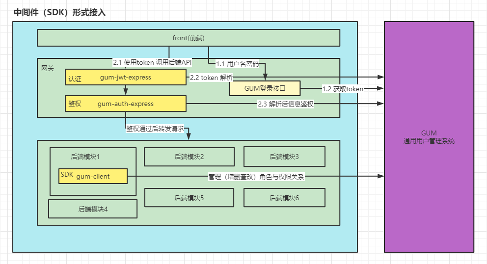
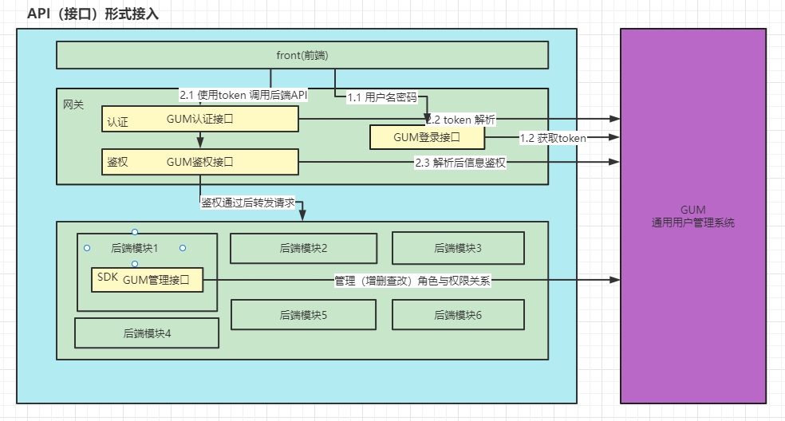

# 用法
## 接入方式
### 1.SDK 接入方式



### 2.API 接入方式


## 前端接入指南
## 后端接入指南
## 客户端(SDK)使用指南
客户端是除了 API 开放接口之外的接入 GUM 系统的另外一种方式。由官方提供如下几种主流语音SDK，方便用户接入。
### 1.Nodejs SDK
#### 1.quick start
```
const GUM = require('gum-client')

async function run () {
  const gumClient = new GUM()
  gumClient.connect('http://192.168.4.193:3000', {
    healthPath: '/health',
    healthProbe: {
      period: 60,
      timeout: 5
    },
    maxRedirects: 5,
    timeout: 5,
    auto_reconnect: true
  })

  gumClient.on('ready',async () => {
    console.log(`连接成功`)
    const addPolicyResult = await gumClient.addPolicy("测试角色", "/api/v1/mock/status", "(GET)|(POST)")
    console.log(JSON.stringify(addPolicyResult))
  })
}

run()
```
#### 2.option 参数说明
*gumClient.connect(url,option)* 中的 `url/option` 参数说明如下
<style>
table, th, td {
  border: 1px solid black;
  border-collapse: collapse;
}
.title {
  font-size: 100%;
  font-weight: bold;
}
</style>
<table>
    <tr>
        <td colspan="5" bgcolor = "#808000" align="center" class="title">option 参数说明</td>
    <tr>
    <tr class="title">
        <td align="center" bgcolor = "#C0C0C0">参数</td>
        <td align="center" bgcolor = "#C0C0C0"> 类型</td>
        <td align="center" bgcolor = "#C0C0C0">是否必填</td>
        <td align="center" bgcolor = "#C0C0C0"> 默认值</td>
        <td align="left" bgcolor = "#C0C0C0">说明</td>
    <tr>
    <tr>
        <td align="left">url</td>
        <td align="center">String</td>
        <td align="center">是</td>
        <td align="center">-</td>
        <td align="left">gum-svc 服务 BaseUrl</td>
    <tr>
    <tr>
        <td align="left">option</td>
        <td align="center">Object</td>
        <td align="center">是</td>
        <td align="center">-</td>
        <td align="left">实例连接 option 选项</td>
    <tr>
    <tr>
        <td align="left">option.healthPath</td>
        <td align="center">String</td>
        <td align="center">否</td>
        <td align="center">/health</td>
        <td align="left">保持连接健康，检查心跳地址</td>
    <tr>
    <tr>
        <td align="left">option.healthProbe</td>
        <td align="center">Object</td>
        <td align="center">否</td>
        <td align="center">-</td>
        <td align="left">实例连接 option 选项</td>
    <tr>
    <tr>
        <td align="left">option.healthProbe.period</td>
        <td align="center">Int</td>
        <td align="center">否</td>
        <td align="center">60</td>
        <td align="left">心跳检查周期（秒）</td>
    <tr>
    <tr>
        <td align="left">option.healthProbe.timeout</td>
        <td align="center">Int</td>
        <td align="center">否</td>
        <td align="center">5</td>
        <td align="left">1次检查的超时时间（秒）</td>
    <tr>
    <tr>
        <td align="left">option.maxRedirects</td>
        <td align="center">Int</td>
        <td align="center">否</td>
        <td align="center">5</td>
        <td align="left">最大重连次数</td>
    <tr>
    <tr>
        <td align="left">option.timeout</td>
        <td align="center">Int</td>
        <td align="center">否</td>
        <td align="center">5</td>
        <td align="left">请求超时时间（秒）</td>
    <tr>
    <tr>
        <td align="left">option.auto_reconnect</td>
        <td align="center">boolean</td>
        <td align="center">否</td>
        <td align="center">true</td>
        <td align="left">是否开启自动重连</td>
    <tr>
</table>

#### 3.事件说明

<table>
    <tr>
        <td colspan="5" bgcolor = "#808000" align="center" class="title">事件说明</td>
    <tr>
    <tr  class="title">
        <td align="center" bgcolor = "#C0C0C0">事件名称</td>
        <td align="center" bgcolor = "#C0C0C0"> 参数说明</td>
        <td align="center" bgcolor = "#C0C0C0">备注</td>
    <tr>
    <tr>
        <td align="left">ready</td>
        <td align="center"> 无参数</td>
        <td align="left">连接成功后事件</td>
    <tr>
    <tr>
        <td align="left">error</td>
        <td align="center"> 无参数</td>
        <td align="left">错误事件</td>
    <tr>
</table>

### 2.JAVA SDK
### 3.Golang SDK
### 4.Python SDK
## 中间件使用指南  
### 认证中间件使用指南
### 鉴权中间件使用指南 
## GUM实践案例